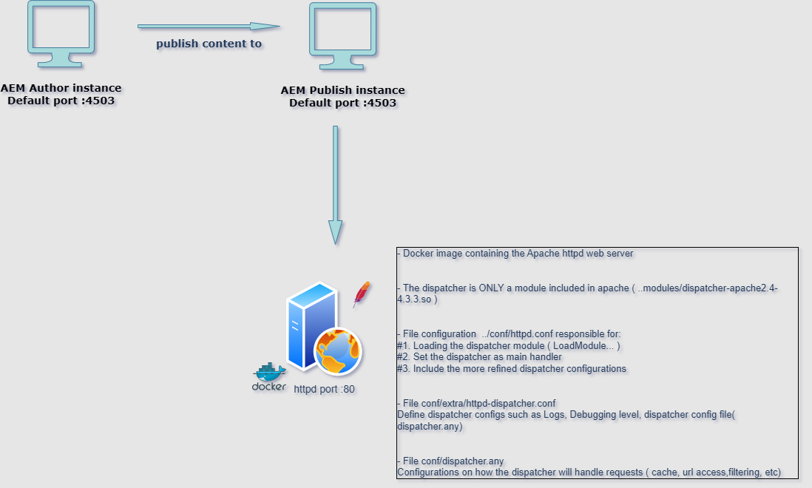

# Sample AEM Dispatcher configuration 

This repository contains a sample configuration for Adobe Experience Manager (AEM) Dispatcher, which is the caching and load balancing tool used to optimize AEM instances. The AEM Dispatcher sits between AEM instances (publish and author) and the client, caching content and ensuring faster delivery to end users while reducing load on the AEM server.



## Details

- **httpd.conf**:  configures the Apache HTTP Server, controlling settings like ports, directories, and modules.
- **dispatcher-apache2.4-4.3.3.so**: AEM dispatcher module for Apache httpd on Linux
- **httpd-dispatcher.conf**: specific configs for the module above
- **dispatcher.any**: configs for how the dispachter will handle requests to content, consoles, etc.
- **Dockerfile**: Used by docker to create an image configuring Apache httpd to use the modules/configs above. 

The dispatcher  will store the cache in **./htdocs** directory. This config is in dispatcher.any

More details:

https://experienceleague.adobe.com/en/docs/experience-manager-dispatcher/using/configuring/dispatcher-configuration

## Installation

The main file is the Dockerfile which contains necessary configurations to create an docker image 

```bash
  docker build -t   my-image-with-aem-dispatcher .
```

To start the recently built image 

```bash
  docker run -dit --name aem-dispatcher-container -p 80:80 -v REPLACE_BY_ABSOLUTE_PATH\htdocs:/usr/local/apache2/htdocs my-image-with-aem-dispatcher
```

So After this, once you hit localhost:80, all the content from publish will be served thru apache httpd

## Tech Stack

- **Docker**

- **Apache httpd**

- **AEM Dispatcher**

## Authors

- [@renatumb](https://github.com/renatumb)